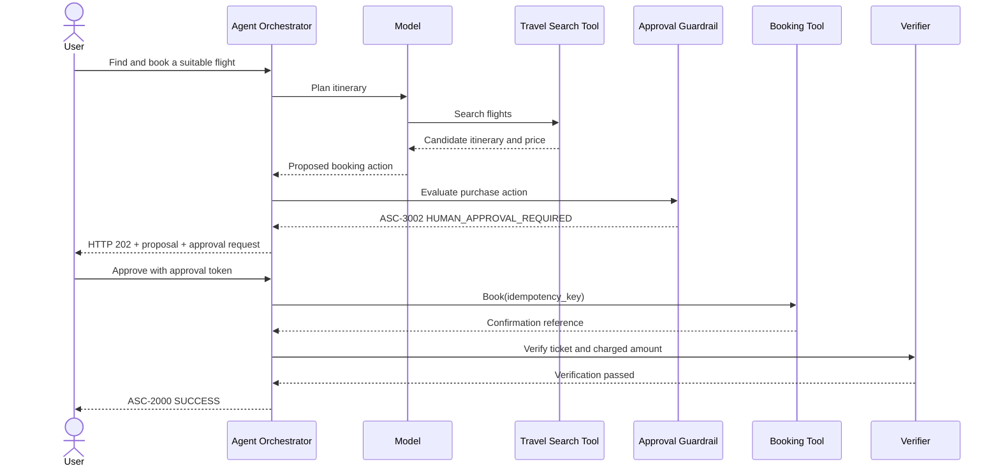

# A Standardised Status-Code System for Autonomous Agents

## Executive summary

Autonomous-agent systems need a common status vocabulary, but a literal copy of HTTP status codes would be insufficient. An HTTP status primarily describes the handling of one transport request; an agent may instead span minutes or days, call many tools, delegate to other agents, wait for human approval, retry dependencies, produce partial artefacts and subsequently fail verification. HTTP itself addresses its limited error vocabulary through machine-readable Problem Details, while Kubernetes supplements a coarse lifecycle phase with independently tracked conditions. Agent protocols such as Agent2Agent already distinguish terminal from interrupted task states, and OpenTelemetry separates operation status from structured attributes, events and metrics. citeturn15search0turn14search6turn16search19turn14search13

This report therefore proposes **Agent Status Codes**, abbreviated **ASC**, as a layered semantic standard rather than a single integer:

\[
\text{Agent status} =
(\text{phase},\ \text{primary code},\ \text{conditions},\ \text{events},\ \text{retry contract})
\]

The primary code gives one canonical summary for a specified scope, such as a task, step or tool call. Conditions preserve simultaneous facts such as low confidence or incomplete provenance. Events record occurrences such as a prompt-cache miss, fallback or retry without replacing the task outcome. Retry metadata says not merely whether another attempt might work, but whether retrying is safe given idempotency and the possibility of partial side effects.

The recommended numeric space uses four decimal digits:

| Range | Meaning |
|---|---|
| `1xxx` | Lifecycle and progress |
| `2xxx` | Successful outcomes |
| `3xxx` | Interrupted, deferred or human-dependent states |
| `4xxx` | Request, authorisation, capability and policy outcomes |
| `5xxx` | Transient operational failures |
| `6xxx` | Fatal, indeterminate or integrity-threatening failures |
| `7xxx` | Trust, quality, grounding and verification outcomes |
| `8xxx` | Non-terminal operational and efficiency events |
| `9xxx` | Extension, private-use and experimental space |

The central design decisions are:

- **Do not overload severity, retryability or lifecycle into the number.** A policy block may be a routine warning in one product and a critical security event in another. Syslog’s independent severity dimension and gRPC’s distinctions among unavailable, aborted and failed-precondition errors demonstrate why these concepts must remain separate. citeturn15search1turn14search1
- **Treat human intervention as an interrupted state, not an error.** LangChain can persist and resume human-in-the-loop execution, OpenAI’s Agents SDK has explicit guardrail tripwires, and A2A models input and authorisation requirements separately from terminal failure. citeturn16search10turn16search21turn16search8
- **Treat prompt-cache hits and misses as events, not outcomes.** OpenTelemetry already records cache-read and cache-creation token usage as telemetry attributes; whether a cache was used does not say whether the agent achieved its goal. citeturn14search7
- **Keep transport and agent semantics distinct.** A synchronous malformed request might use HTTP `400`; an asynchronously executing task should normally return HTTP `200` when its status resource is read, even when its embedded ASC says `FATAL_ERROR`. RFC 9457 Problem Details can carry ASC information when an HTTP-level failure is also present. citeturn15search0turn15search2
- **Make retry decisions explicit and side-effect aware.** A timeout after an irreversible tool call is not safely retryable merely because it resembles a transient network failure. gRPC similarly distinguishes retrying an individual unavailable call from restarting a higher-level transaction, and its retry configuration includes status matching, attempt limits and back-off. citeturn14search1turn14search14
- **Integrate with, rather than replace, OpenTelemetry, A2A, MCP, HTTP and gRPC.** ASC should supply a low-cardinality semantic layer that can be carried in each protocol’s native extension or detail mechanism.

The recommended first standard should contain a small stable core, a normative JSON envelope, transport mappings, OpenTelemetry semantic conventions, conformance tests and a public registry. It should not attempt to enumerate every model-provider exception or every safety policy. Vendor details belong in typed extensions and causal chains beneath the standard code.

## Motivation and design requirements

**Developer experience.** Agent frameworks currently expose heterogeneous signals: Python exceptions, tool-return strings, guardrail tripwires, graph interrupts, task states, callback events and provider-specific error codes. For example, the OpenAI Agents SDK identifies model-behaviour errors such as nonexistent tool calls or malformed JSON, while LangChain discusses retries, fallbacks, timeouts, rate limits, call limits and human steering as distinct production concerns. Without a shared vocabulary, an application integrating several runtimes must repeatedly translate semantically similar conditions. citeturn16search15turn16search2

A standard code lets an SDK offer stable control flow:

```python
if result.status.name == "RATE_LIMITED" and result.retry.safe:
    await retry(result.retry.after_ms)
elif result.status.name == "HUMAN_APPROVAL_REQUIRED":
    await approval_queue.submit(result)
elif result.status.name == "PERMISSION_DENIED":
    show_access_request()
```

The code should be stable across providers, while the diagnostic message, original provider code and causal stack remain available for debugging.

**Observability and diagnosis.** Agent executions are distributed workflows, not single model calls. OpenAI’s Agents SDK tracing records generations, tool calls, hand-offs, guardrails and custom events. OpenTelemetry’s GenAI conventions similarly model logical operations and recommend that an operation span cover automatic retries; its agent conventions call for low-cardinality error identifiers. citeturn16search18turn19search4turn19search0

ASC would allow an operator to answer questions that are otherwise difficult to query consistently:

- What percentage of research tasks end in `PARTIAL_SUCCESS`?
- Which tools generate most `RATE_LIMITED` transitions?
- How long do tasks remain in `HUMAN_APPROVAL_REQUIRED`?
- How often does an apparent `TIMEOUT` leave an unknown side-effect state?
- Which agent or model revision correlates with `HALLUCINATION_DETECTED`?
- Are `GUARDRAIL_BLOCKED` events increasing for one policy family or tenant?

The standard must consequently define aggregation-safe dimensions. Codes and short names may be metric labels; user IDs, task IDs, prompts, URLs and free-form messages must not be.

**User-facing communication.** A status needs at least three audiences:

| Audience | Required characteristics |
|---|---|
| End user | Safe, localisable, concise and actionable |
| Developer | Precise category, scope, retry contract and causal information |
| Operator or auditor | Correlation identifiers, policy/evaluator provenance, timestamps and protected diagnostics |

A single exception message cannot serve all three safely. “The request could not be completed because approval is required” may be appropriate for a user, while a protected diagnostic can state that the agent attempted a financial transaction above an approval threshold. The public message should not reveal hidden policy thresholds, resource existence or internal architecture.

**Security and guardrails.** Autonomous tools may change files, spend money, communicate externally or invoke code. MCP’s security guidance treats tools as potentially dangerous and requires validation, access control, rate limiting and user understanding or consent. LangChain explicitly supports human oversight for sensitive operations, while OpenAI guardrails can halt execution before or during an agent run. citeturn16search17turn16search6turn16search3

A standard must distinguish at least:

- a request rejected because it is invalid;
- an authenticated principal lacking permission;
- a policy decision blocking an otherwise technically valid action;
- a request paused for human approval;
- an output transformed or redacted while the remaining task succeeds;
- a security or integrity verification failure;
- a model refusal, which may or may not be equivalent to an application policy block.

Conflating these states impairs remediation and can create security problems. For example, repeatedly retrying a policy block wastes resources and may constitute guardrail probing.

**Monitoring and alerting.** Not every non-success status warrants an alert. `PROMPT_CACHE_MISS` may be normal; `HUMAN_INPUT_REQUIRED` may be expected; `RATE_LIMITED` may merit an alert only when sustained; `RESULT_STATE_UNKNOWN` after a payment should generate immediate operational attention. The code supplies the semantic category, while deployment policy determines alert thresholds and severity.

**Scope.** ASC should work at multiple levels:

| Scope | Example |
|---|---|
| Conversation | A long-lived user-agent interaction |
| Task or run | “Prepare and send the weekly report” |
| Step or node | “Summarise the sales data” |
| Delegation | A request sent to a specialist agent |
| Model invocation | One inference operation |
| Tool call | One calendar, database or payment call |
| Guardrail decision | Approval, rejection or transformation |
| Evaluation | Groundedness or policy-verification result |
| Artefact | A report, code patch or generated file |

Every envelope must state its `scope`. A parent task may report `PARTIAL_SUCCESS` while a child tool call reports `PERMISSION_DENIED`; neither should overwrite the other.

## Lessons from existing standards and agent ecosystems

No existing standard supplies all the required semantics. The strongest design emerges by combining their useful properties while avoiding their scope-specific limitations.

| Standard or ecosystem | Useful precedent | Limitation for autonomous agents | Design lesson for ASC |
|---|---|---|---|
| HTTP status codes | Compact numeric classes, broad familiarity and a centrally maintained IANA registry. HTTP divides results into informational, success, redirection, client-error and server-error classes. citeturn15search2turn15search13 | Describes an HTTP request, not a long-running, multi-step goal. A valid status-resource request can succeed even though the represented agent task failed. | Use recognisable numeric classes, but never equate agent outcome with transport outcome. |
| RFC 9457 Problem Details | Defines a common machine-readable error document rather than requiring every API to invent one. citeturn15search0turn15search21 | Primarily error-oriented and HTTP-specific; agent interruptions, conditions and successful-with-warning outcomes are broader. | Reuse the structured-envelope pattern and allow ASC as a Problem Details extension. |
| gRPC canonical status | Provides cross-language categories such as `PERMISSION_DENIED`, `RESOURCE_EXHAUSTED`, `FAILED_PRECONDITION`, `ABORTED`, `UNAVAILABLE` and `DEADLINE_EXCEEDED`. It distinguishes retrying one failed call from restarting a higher-level transaction. citeturn14search1turn14search8 | Represents an RPC termination, not all internal task transitions or quality evaluations. | Reuse familiar names and distinguish local retry, workflow restart and precondition repair. |
| Syslog | Separates facility and severity and defines eight severity levels from emergency to debug. citeturn15search1turn15search5 | Severity says how urgent an event is, not what happened or whether retry is safe. | Keep severity independent of the primary code. |
| POSIX and shell exit status | Extremely simple process-level success/failure contract; established values such as `126` and `127` distinguish “found but not executable” from “not found”. citeturn18search0turn18search17 | One small integer at process termination cannot represent progress, partial results, causal trees or human intervention. | Provide a lossy exit-code projection, but retain the full ASC envelope elsewhere. |
| Kubernetes | Uses a coarse phase plus independent conditions; Kubernetes explicitly notes that one phase cannot capture the complete picture. Conditions include status, reason, message and transition information. citeturn14search2turn14search6 | Infrastructure-specific and not intended to express grounding, guardrail or human-decision semantics. | Adopt the phase-plus-conditions model and preserve transition history. |
| OpenTelemetry | Defines shared attributes for traces, metrics and logs; span status is `Unset`, `Error` or explicit `Ok`, while richer meaning is expressed through attributes and events. GenAI conventions are developing agent-, model-, tool- and evaluation-specific semantics. citeturn14search13turn19search1turn19search24 | Deliberately an observability model, not an application control-flow or end-user protocol. | Export ASC into OTel rather than using OTel span status as the agent status system. |
| Agent2Agent | Defines a stateful task lifecycle with submitted, working, completed, failed, cancelled, rejected, input-required and auth-required states, together with status messages and protocol versioning. citeturn16search19turn16search25 | States are intentionally coarse and do not identify rate limits, partial success, quality failures or safe retry behaviour. | Preserve A2A’s lifecycle state and carry ASC as a finer-grained status extension. |
| Model Context Protocol | Separates JSON-RPC protocol errors from tool-execution errors. Tool errors can be returned with `isError: true` so a model can see the failure and self-correct. citeturn16search5turn16search23 | `isError` is Boolean and does not standardise cause, severity, side effects or retry safety. | Embed ASC in structured tool results without turning ordinary tool failures into protocol errors. |
| LangChain and LangGraph | Agents loop over model and tool calls; production guidance covers retries, fallbacks, rate limits, timeouts, permissions, checkpoints and resumable human intervention. citeturn16search2turn16search10turn16search14 | Signals are framework-specific middleware events, interrupts and exceptions. | Standardise the semantics while permitting framework-native implementation. |
| ReAct | Interleaves reasoning and actions, with observations from external environments updating subsequent execution; the work explicitly discusses handling exceptions and reducing error propagation through interaction. citeturn17search0turn17search3 | A reasoning-and-action pattern, not an interoperability or status specification. | Status transitions should be model-visible where remediation is possible, without disclosing hidden reasoning traces. |
| OpenAI Agents SDK | Exposes model-behaviour errors, refusals, maximum-turn failures, guardrail tripwires and tracing of tool calls and hand-offs. citeturn16search15turn16search27turn16search18 | Exception classes remain SDK-specific. | Define normative mappings from runtime exceptions to portable ASC values. |
| AutoGPT | Provides an open-source platform for building, deploying and running agents and complete workflows; AutoGPT Classic demonstrated autonomous chaining of tasks. citeturn17search1turn17search16 | The surveyed project material does not define a cross-framework status registry. | Workflow products need portable run and block semantics rather than dashboard-specific labels. |

The survey supports five conclusions.

First, **a code must identify semantics, not presentation**. Numeric classes aid recognition, but clients should compare the stable short name or registry identity rather than infer every behaviour from arithmetic alone.

Second, **status and severity are orthogonal**. `HUMAN_APPROVAL_REQUIRED` may be informational in a well-designed procurement workflow but critical if a production queue has been waiting for two days. `GUARDRAIL_BLOCKED` may indicate expected enforcement, not system malfunction.

Third, **retryability is not Boolean in practice**. It has at least four dimensions:

\[
\text{retry decision} =
f(\text{transience},\ \text{idempotency},\ \text{side-effect certainty},\ \text{budget})
\]

A call can be transiently failed but unsafe to repeat. Conversely, `FAILED_PRECONDITION` can become retryable after an explicit state change. gRPC’s distinctions between `UNAVAILABLE`, `ABORTED` and `FAILED_PRECONDITION` are a useful precedent. citeturn14search1

Fourth, **interruption is not failure**. Human input and authorisation are recognised lifecycle states in A2A, and modern agent frameworks persist execution around human decisions. citeturn16search8turn16search10

Fifth, **quality and provenance are first-class**. A response can be technically generated yet fail a grounding or integrity requirement. These outcomes must not be collapsed into `INTERNAL_ERROR`, because their remediation—retrieve better evidence, use a different evaluator, regenerate or disclose uncertainty—is different.

## Proposed taxonomy and code space

**Status model.** An ASC implementation should maintain four related constructs:

| Construct | Cardinality | Purpose |
|---|---:|---|
| Lifecycle phase | Exactly one | Coarse position: queued, executing, waiting or finished |
| Primary status | Exactly one per reported scope | Best current summary for application control flow |
| Conditions | Zero or more | Simultaneous durable facts, such as low confidence or provenance incomplete |
| Events | Zero or more | Point-in-time occurrences, such as a cache miss or retry |

Recommended lifecycle phases are `QUEUED`, `EXECUTING`, `WAITING`, `FINISHED` and `UNKNOWN`. They deliberately remain much coarser than the numeric statuses.

**Numbering rules.**

1. Codes are unsigned four-digit decimal integers rendered canonically as `ASC-5001`.
2. Symbolic names use upper-case ASCII `SNAKE_CASE`, such as `HUMAN_APPROVAL_REQUIRED`.
3. A registered code’s meaning is immutable. A deprecated code remains reserved forever.
4. Unknown codes must be handled by class: a client that does not recognise `ASC-5017` still knows it is a transient operational failure.
5. Codes describe semantics, not a particular provider, model or programming-language exception.
6. The envelope identifies whether the code is being used as a `status`, `condition` or `event`.
7. Codes from `8000` to `8999` are event-only unless a later standard explicitly assigns a non-event range.
8. `9000–9499` are registered extensions, `9500–9799` private use, `9800–9899` experimental, and `9900–9999` reserved.
9. Standard allocations should be sparse, leaving room for related concepts adjacent to one another.
10. Producers must include both code and name; consumers should reject a mismatched registered pair as an integrity or implementation error.

**Proposed core registry.** “Retryable?” below is a default semantic indication, not permission to repeat an operation blindly. The final decision must also inspect `retry.safe`, side-effect state and attempt budget. HTTP mappings describe synchronous transport conventions; a task-status resource will commonly return HTTP `200` with the ASC embedded.

| Code | Short name | Description | Default severity | Retryable? | Suggested HTTP mapping |
|---:|---|---|---|---|---:|
| `1000` | `ACCEPTED` | Request acknowledged but substantive execution has not started | Info | N/A | `202` |
| `1010` | `RUNNING` | Work is actively progressing | Info | N/A | `200` or `202` |
| `1020` | `WAITING_DEPENDENCY` | Paused until a declared dependency becomes available | Notice | Conditional | `202` |
| `1030` | `RETRY_SCHEDULED` | A retry has been scheduled under policy | Notice | Yes | `202` |
| `2000` | `SUCCESS` | Requested goal fully achieved | Info | No | `200`, `201` or `204` |
| `2001` | `SUCCESS_WITH_WARNINGS` | Goal achieved with non-blocking caveats | Warning | No | `200` |
| `2002` | `PARTIAL_SUCCESS` | Some requested units succeeded and others did not | Warning | Per failed unit | `200` |
| `2003` | `NO_ACTION_REQUIRED` | Request valid, but desired state already held or no action was necessary | Info | No | `200` or `204` |
| `3001` | `HUMAN_INPUT_REQUIRED` | Missing or ambiguous information must be supplied by a person | Notice | After input | `202`; `409` for non-resumable synchronous APIs |
| `3002` | `HUMAN_APPROVAL_REQUIRED` | A proposed action awaits an explicit human decision | Warning | After approval | `202`; `409` for non-resumable synchronous APIs |
| `3003` | `AUTHENTICATION_REQUIRED` | Authentication, reauthentication or delegated credentials are needed | Warning | After authentication | `401` |
| `3004` | `CANCELLED` | Execution was cancelled by a caller, user or authorised controller | Notice | Normally no | `200` or `204` on cancellation endpoint |
| `4000` | `INVALID_REQUEST` | Input is syntactically or semantically invalid | Error | After correction | `400` or `422` |
| `4001` | `FAILED_PRECONDITION` | Valid operation cannot proceed in the current state | Error | After state repair | `409` or `412` |
| `4002` | `PERMISSION_DENIED` | Authenticated principal is not authorised for the operation | Error | After permission change | `403` |
| `4003` | `GUARDRAIL_BLOCKED` | Policy or safety control prohibited the proposed operation or output | Warning or Error | Normally no | `403`; sometimes `422` |
| `4004` | `POLICY_REDACTED` | Policy transformed, removed or withheld part of an otherwise usable result | Warning | No | `200`; `403` if all output withheld |
| `4005` | `CONFLICT` | Concurrent update, version or state conflict prevented completion | Error | Conditional | `409` |
| `4006` | `NOT_FOUND` | Required task, resource, agent or tool could not be located | Error | Normally no | `404` |
| `4007` | `UNSUPPORTED_CAPABILITY` | Requested capability is not implemented or advertised | Error | No | `422` or `501` |
| `5000` | `RETRYABLE_ERROR` | Unclassified transient failure for which a bounded retry may succeed | Error | Yes, with policy | `503` |
| `5001` | `RATE_LIMITED` | Provider, tenant or tool rate limit was reached | Warning | After delay | `429` |
| `5002` | `RESOURCE_EXHAUSTED` | Token, memory, compute, context, storage or quota resource was exhausted | Error | Conditional | `429` for quota; `503` for capacity |
| `5003` | `DEPENDENCY_UNAVAILABLE` | Required model, tool, agent or service is temporarily unavailable | Error | Usually | `503` |
| `5004` | `TIMEOUT` | Declared deadline expired before a definitive result was obtained | Error | Conditional | `504` for upstream; otherwise `503` |
| `5005` | `TOOL_EXECUTION_FAILED` | A tool accepted the invocation but failed while executing it | Error | Tool-specific | `502` or `503` |
| `5006` | `ABORTED_CONCURRENCY` | Operation was aborted due to concurrency or transactional conflict | Warning | At higher level | `409` |
| `6000` | `FATAL_ERROR` | Unrecoverable failure not represented by a more specific code | Critical | No | `500` |
| `6001` | `INTERNAL_ERROR` | Unexpected exception, invariant violation or implementation defect | Critical | Not automatically | `500` |
| `6002` | `MODEL_BEHAVIOUR_ERROR` | Model emitted malformed structure, an unknown tool call or another protocol-invalid action | Error | Conditional fallback | `500` or `502` |
| `6003` | `DATA_LOSS` | Required state, memory, evidence or artefact was lost or corrupted | Critical | No | `500` |
| `6004` | `MAX_ITERATIONS_EXCEEDED` | Turn, step, recursion or loop budget was exhausted | Error | Only under revised policy | `422` or `500` |
| `6005` | `RESULT_STATE_UNKNOWN` | System cannot determine whether a potentially side-effecting operation committed | Critical | **Never blindly** | `502` or `504` |
| `7000` | `OUTPUT_UNVERIFIED` | Required verification was unavailable or not completed | Warning | Conditional | `200` with warning; `422` if withheld |
| `7001` | `LOW_CONFIDENCE` | A named quality metric fell below its declared threshold | Warning | Conditional | `200` |
| `7002` | `HALLUCINATION_SUSPECTED` | Detector found indicators of unsupported or contradictory content, without conclusive verification | Warning | Regeneration possible | `200` or `422` |
| `7003` | `HALLUCINATION_DETECTED` | Verification established that material output lacks required support or contradicts authoritative evidence | Error | Regenerate or repair | `422` if withheld |
| `7004` | `PROVENANCE_INCOMPLETE` | Required source, evidence or derivation lineage is missing | Warning | Conditional | `200` or `422` |
| `7005` | `INTEGRITY_CHECK_FAILED` | Signature, hash, schema, policy-attestation or equivalent integrity check failed | Error or Critical | Normally no | `422` or `500` |
| `8000` | `PROMPT_CACHE_HIT` | Event: eligible input was served wholly or partly from a prompt cache | Info | N/A | Same as parent |
| `8001` | `PROMPT_CACHE_MISS` | Event: eligible input was not served from the prompt cache | Debug or Info | N/A | Same as parent |
| `8002` | `FALLBACK_USED` | Event: execution switched to an alternate model, tool, agent or route | Notice | N/A | Same as parent |
| `8003` | `RETRY_ATTEMPTED` | Event: another execution attempt began | Notice | N/A | Same as parent |

Several distinctions in this registry are intentionally strict.

**`SUCCESS_WITH_WARNINGS` versus `PARTIAL_SUCCESS`.** The former means the requested goal was achieved, although caveats should be disclosed. The latter means some independently requested result or side effect was not achieved. A summary generated with incomplete provenance may be `SUCCESS_WITH_WARNINGS`; “refund order and email the customer” when only the email succeeded is `PARTIAL_SUCCESS`.

**`GUARDRAIL_BLOCKED` versus `PERMISSION_DENIED`.** Permission is an authorisation decision about the principal and resource. A guardrail is a policy decision about the proposed content, context or action. The two may occur together but should not be treated as synonyms.

**`TIMEOUT` versus `RESULT_STATE_UNKNOWN`.** `TIMEOUT` says a deadline elapsed. `RESULT_STATE_UNKNOWN` says an operation might have committed and its outcome cannot be safely established. The latter is especially important for payments, messages, bookings and external mutations.

**`HALLUCINATION_SUSPECTED` versus `HALLUCINATION_DETECTED`.** A heuristic detector, unsupported-confidence estimate or evaluator disagreement should usually produce `SUSPECTED`. `DETECTED` should require a declared verification procedure and evidence. This avoids presenting a fallible detector as ground truth.

**Prompt caching.** Cache codes are events because cache behaviour is an execution optimisation, not an answer to whether the goal succeeded. OpenTelemetry’s GenAI registry likewise represents cache reads and cache creation through token-usage telemetry. citeturn14search7

## Status envelope, observability and API integration

**Canonical envelope.** The numeric code should always travel in a structured message. A proposed JSON representation is:

```json
{
  "spec_version": "1.0.0",
  "status": {
    "code": 5001,
    "name": "RATE_LIMITED",
    "kind": "status",
    "class": "transient_failure",
    "scope": "tool_call",
    "phase": "EXECUTING",
    "terminal": false,
    "severity": "warning"
  },
  "message": {
    "user": "The calendar service is busy. The task will retry shortly.",
    "developer": "Provider quota window exceeded during create_event.",
    "locale": "en-GB"
  },
  "retry": {
    "retryable": true,
    "safe": true,
    "after_ms": 2000,
    "strategy": "exponential_backoff",
    "attempt": 2,
    "max_attempts": 5,
    "idempotency_key": "cal-7c27b9"
  },
  "remediation": [
    {
      "action": "retry",
      "after_ms": 2000
    },
    {
      "action": "request_quota_increase",
      "target": "calendar-provider"
    }
  ],
  "provenance": {
    "run_id": "run-18a9",
    "step_id": "step-07",
    "agent_id": "scheduling-agent",
    "tool_call_id": "call-b314",
    "provider_code": "quota_window_exceeded",
    "policy_id": null,
    "evaluator_id": null,
    "trace_id": "0af7651916cd43dd8448eb211c80319c",
    "span_id": "b7ad6b7169203331"
  },
  "confidence": null,
  "causes": [],
  "conditions": [],
  "events": [
    {
      "code": 8001,
      "name": "PROMPT_CACHE_MISS",
      "occurred_at": "2026-08-07T10:24:16.612Z"
    },
    {
      "code": 8003,
      "name": "RETRY_ATTEMPTED",
      "occurred_at": "2026-08-07T10:24:18.613Z"
    }
  ],
  "details": {
    "limit_scope": "tenant",
    "remaining": 0
  },
  "occurred_at": "2026-08-07T10:24:16.610Z"
}
```

The minimum interoperable fields should be `spec_version`, `status.code`, `status.name`, `status.kind`, `status.scope`, `status.terminal` and `occurred_at`. Everything else can be profile-dependent.

**Message semantics.**

- `message.user` must be safe to expose and suitable for localisation.
- `message.developer` is a diagnostic summary, not a stack trace.
- Sensitive operator diagnostics should be stored in a protected log or referenced through a diagnostic identifier.
- `remediation` uses machine-readable actions rather than relying solely on prose.
- `causes` contains nested status envelopes or compact causal references, with cycle and depth limits.
- `details` is namespaced extension data and must not alter the registered meaning of the code.

RFC 9457 provides a close precedent for separating a stable problem type from a human-readable title and occurrence-specific details. citeturn15search0turn15search21

**Confidence.** A bare field such as `"confidence": 0.8` is not interoperable. It does not identify whether the number measures probability of factual correctness, groundedness, intent classification, evaluator agreement or model token likelihood. The standard should require:

```json
{
  "metric": "groundedness",
  "value": 0.81,
  "range": {
    "minimum": 0.0,
    "maximum": 1.0
  },
  "threshold": 0.90,
  "method": "retrieval-entailment-evaluator",
  "evaluator_version": "3.2.1",
  "calibrated": true,
  "evidence_set_id": "evidence-91d2"
}
```

OpenTelemetry’s GenAI attributes already distinguish evaluation metric name, score value and human-readable label, supporting this metric-specific approach. citeturn14search7

Confidence should never be used as an authorisation credential. It is an observation from a declared method, not a guarantee.

**Provenance without chain-of-thought.** Provenance should identify agents, tools, models, evidence, evaluators, policies, traces and artefacts. It should not require disclosure or persistence of private model reasoning. ReAct demonstrates that reasoning and external actions are conceptually distinct; interoperability requires action and observation lineage, not unrestricted access to internal reasoning traces. citeturn17search3

**OpenTelemetry mapping.** ASC augments OTel rather than replacing its three-valued span status. OpenTelemetry recommends leaving successful spans `Unset` unless an application deliberately marks them `Ok`; error spans use `Error`. citeturn19search1turn19search5

Recommended span attributes are:

```text
agent.status.code                 = 5001
agent.status.name                 = "RATE_LIMITED"
agent.status.class                = "transient_failure"
agent.status.kind                 = "status"
agent.status.scope                = "tool_call"
agent.status.terminal             = false
agent.status.retryable            = true
agent.status.retry_safe           = true
agent.lifecycle.phase             = "EXECUTING"
agent.human_action.required       = false
agent.guardrail.decision          = "not_evaluated"
error.type                        = "RATE_LIMITED"
```

The registered short name is appropriate for `error.type` because OpenTelemetry recommends provider/library codes, canonical exception names or another documented low-cardinality error identifier. citeturn19search0

Transitions and non-terminal occurrences belong in span events:

```python
from opentelemetry import trace
from opentelemetry.trace import Status, StatusCode

tracer = trace.get_tracer("example.agent")

with tracer.start_as_current_span("invoke_agent scheduling-agent") as span:
    result = run_agent()

    status = result["status"]
    span.set_attribute("agent.status.code", status["code"])
    span.set_attribute("agent.status.name", status["name"])
    span.set_attribute("agent.status.scope", status["scope"])
    span.set_attribute("agent.status.terminal", status["terminal"])

    span.add_event(
        "agent.status.transition",
        {
            "agent.status.code": status["code"],
            "agent.status.name": status["name"],
            "agent.lifecycle.phase": status["phase"]
        }
    )

    if status["code"] in range(5000, 8000) and status["terminal"]:
        span.set_status(
            Status(StatusCode.ERROR, description=status["name"])
        )
```

A non-terminal `RATE_LIMITED` event that is successfully retried need not make the entire task span an error; it can appear as an event or as an errored child-attempt span. OpenTelemetry’s GenAI guidance treats a logical operation with automatic retries as one operation span, permitting attempt details to be modelled beneath or within it. citeturn19search4

**Metrics.** Recommended metric names include:

```text
agent.runs{agent.name,status.name,status.class}
agent.run.duration{agent.name,status.class}
agent.status.transitions{from,to}
agent.retry.attempts{reason,dependency}
agent.guardrail.decisions{decision,policy.family}
agent.human.wait.duration{request.type}
agent.verification.failures{metric,evaluator}
agent.prompt_cache.tokens{operation=read|write}
agent.result_state_unknown{tool.family}
```

Dimensions must remain bounded. `run_id`, user ID, complete tool name where dynamically generated, prompt content and error messages belong in traces or logs rather than metric labels.

**Logs.** A JSON log record should include timestamp, severity, ASC code and name, scope, run/step/tool identifiers, trace and span IDs, terminal flag and a redacted diagnostic. W3C Trace Context provides a vendor-neutral `traceparent` format for correlating work across services. citeturn18search2

Syslog severity can be mapped independently:

| ASC severity | Suggested syslog level |
|---|---|
| Critical | `2` Critical |
| Error | `3` Error |
| Warning | `4` Warning |
| Notice | `5` Notice |
| Info | `6` Informational |
| Debug | `7` Debug |

Emergency and Alert should remain deployment decisions rather than automatic ASC mappings, because a single agent failure rarely proves that an entire system is unusable. RFC 5424 defines the standard zero-to-seven severity scale. citeturn15search1

**Alerting.** Alert policies should operate on service-level behaviour:

- alert on a sustained ratio of `5xxx` outcomes rather than every retry;
- page immediately for `RESULT_STATE_UNKNOWN` in high-impact tools;
- alert on a material increase in `6001 INTERNAL_ERROR`, `6003 DATA_LOSS` or `7005 INTEGRITY_CHECK_FAILED`;
- monitor human-wait age and queue depth, not merely the count of `3001` and `3002`;
- compare `GUARDRAIL_BLOCKED` rates by policy family and application version;
- use cache events for cost and latency optimisation, not availability paging.

**HTTP integration.** ASC must not create new HTTP codes for every agent outcome.

For a synchronous invocation:

```http
HTTP/1.1 429 Too Many Requests
Content-Type: application/problem+json
Retry-After: 2
```

```json
{
  "type": "urn:agent-status:RATE_LIMITED",
  "title": "Agent dependency rate-limited",
  "status": 429,
  "detail": "The calendar provider rejected the current attempt.",
  "agent_status": {
    "code": 5001,
    "name": "RATE_LIMITED",
    "scope": "tool_call",
    "terminal": false
  },
  "retry": {
    "retryable": true,
    "safe": true,
    "after_ms": 2000
  }
}
```

For asynchronous work:

```text
POST /agent-runs        -> HTTP 202, run ID, ASC-1000 ACCEPTED
GET  /agent-runs/123    -> HTTP 200, embedded current ASC
POST /agent-runs/123/approve -> HTTP 200 or 202
DELETE /agent-runs/123  -> HTTP 204, task transitions to ASC-3004
```

If run `123` ends in `ASC-6001 INTERNAL_ERROR`, `GET /agent-runs/123` should still return HTTP `200` because retrieval of the status resource succeeded. Returning HTTP `500` would confuse failure of the represented run with failure to read its record.

**gRPC integration.** A failed RPC should retain the closest canonical gRPC status while placing ASC in typed status details or response metadata. For example:

| ASC | gRPC projection |
|---|---|
| `RATE_LIMITED` | `RESOURCE_EXHAUSTED` |
| `PERMISSION_DENIED` | `PERMISSION_DENIED` |
| `TIMEOUT` | `DEADLINE_EXCEEDED` |
| `DEPENDENCY_UNAVAILABLE` | `UNAVAILABLE` |
| `FAILED_PRECONDITION` | `FAILED_PRECONDITION` |
| `ABORTED_CONCURRENCY` | `ABORTED` |
| `INTERNAL_ERROR` | `INTERNAL` |
| `DATA_LOSS` | `DATA_LOSS` |

gRPC’s canonical vocabulary provides these transport-level categories, but the ASC detail can additionally communicate scope, terminality, human remediation and safe-retry information. citeturn14search1

**A2A integration.** The A2A task state remains the coarse lifecycle signal:

| A2A state | Example ASC refinement |
|---|---|
| `TASK_STATE_SUBMITTED` | `ACCEPTED` |
| `TASK_STATE_WORKING` | `RUNNING`, `RETRY_SCHEDULED` |
| `TASK_STATE_INPUT_REQUIRED` | `HUMAN_INPUT_REQUIRED` |
| `TASK_STATE_AUTH_REQUIRED` | `AUTHENTICATION_REQUIRED` |
| `TASK_STATE_COMPLETED` | `SUCCESS`, `SUCCESS_WITH_WARNINGS`, `PARTIAL_SUCCESS` |
| `TASK_STATE_REJECTED` | `GUARDRAIL_BLOCKED`, `PERMISSION_DENIED`, `UNSUPPORTED_CAPABILITY` |
| `TASK_STATE_FAILED` | Any terminal `5xxx`, `6xxx` or withholding `7xxx` code |
| `TASK_STATE_CANCELED` | `CANCELLED` |

A2A’s latest task model and versioned protocol definitions make such an extension preferable to replacing its state enumeration. citeturn16search19turn16search25

**MCP integration.** Unknown tools and malformed MCP requests remain JSON-RPC protocol errors. A tool execution failure remains a successful protocol response with `isError: true`, augmented with a structured ASC object:

```json
{
  "content": [
    {
      "type": "text",
      "text": "The customer record is read-only for this principal."
    },
    {
      "type": "resource",
      "resource": {
        "mimeType": "application/agent-status+json",
        "text": "{\"code\":4002,\"name\":\"PERMISSION_DENIED\",\"scope\":\"tool_call\"}"
      }
    }
  ],
  "isError": true
}
```

This preserves MCP’s ability to expose execution failures to the model for self-correction while replacing unstructured error-string parsing with portable semantics. citeturn16search9turn16search23

**SDK design and backward compatibility.**

```python
from dataclasses import dataclass
from enum import IntEnum
from typing import Any


class AgentStatusCode(IntEnum):
    SUCCESS = 2000
    PARTIAL_SUCCESS = 2002
    HUMAN_INPUT_REQUIRED = 3001
    HUMAN_APPROVAL_REQUIRED = 3002
    PERMISSION_DENIED = 4002
    GUARDRAIL_BLOCKED = 4003
    RATE_LIMITED = 5001
    TIMEOUT = 5004
    INTERNAL_ERROR = 6001
    RESULT_STATE_UNKNOWN = 6005
    HALLUCINATION_DETECTED = 7003


@dataclass(frozen=True)
class RetryContract:
    retryable: bool
    safe: bool
    after_ms: int | None = None
    idempotency_key: str | None = None


@dataclass(frozen=True)
class AgentStatus:
    code: int
    name: str
    terminal: bool
    scope: str
    retry: RetryContract
    details: dict[str, Any]


def should_retry(
    status: AgentStatus,
    *,
    operation_is_idempotent: bool,
    attempts_remaining: bool
) -> bool:
    if not attempts_remaining:
        return False

    if status.code == AgentStatusCode.RESULT_STATE_UNKNOWN:
        return False

    return (
        status.retry.retryable
        and status.retry.safe
        and (
            operation_is_idempotent
            or status.retry.idempotency_key is not None
        )
    )
```

An SDK should offer both result-oriented and exception-oriented styles. Interrupted states such as human approval should generally be values, not exceptions, because they are expected resumable control flow. Protocol corruption, schema mismatch and programming errors may remain exceptions.

Unknown future fields must be ignored and preserved where practical. Unknown codes must not crash a client: it should use the first-digit class, display a generic safe message and retain the raw code for diagnostics. Existing code meanings must never be changed or reused.

## Real-world scenarios and implementation examples

**High-value travel booking with human approval.** A user asks an agent to find and book a flight. Searching is permitted autonomously, but committing a purchase requires explicit approval. The agent returns `ASC-3002 HUMAN_APPROVAL_REQUIRED`, including the proposed itinerary, price, expiry time and a safe approval token. After approval, it executes the booking with an idempotency key, verifies the confirmation and finishes with `ASC-2000 SUCCESS`.

This pattern corresponds to the resumable human-in-the-loop capabilities documented by LangChain and to guardrail tripwires and tool controls in the OpenAI Agents SDK. citeturn16search10turn16search11



A representative approval status is:

```json
{
  "spec_version": "1.0.0",
  "status": {
    "code": 3002,
    "name": "HUMAN_APPROVAL_REQUIRED",
    "kind": "status",
    "scope": "task",
    "phase": "WAITING",
    "terminal": false,
    "severity": "warning"
  },
  "message": {
    "user": "Approval is required before purchasing this flight.",
    "developer": "Purchase action exceeded autonomous-spend policy.",
    "locale": "en-GB"
  },
  "remediation": [
    {
      "action": "approve",
      "approval_request_id": "approval-e721",
      "expires_at": "2026-08-07T10:45:00Z"
    },
    {
      "action": "reject",
      "approval_request_id": "approval-e721"
    }
  ],
  "details": {
    "proposed_action": "purchase_flight",
    "currency": "GBP",
    "amount": "486.20"
  }
}
```

The public object need not expose the internal policy threshold. A protected audit record can retain the policy version and decision evidence.

A booking timeout requires particular care. If the request definitely never reached the booking service, the tool call may return `TIMEOUT` with `retry.safe=true`. If the service may have processed the charge but its reply was lost, the correct result is `RESULT_STATE_UNKNOWN`, and the remediation is to reconcile by idempotency key or booking reference—not to issue another purchase.

**Customer-support workflow with partial success.** A support agent is asked to refund an order and send a confirmation email. It reads the order successfully, but its service identity lacks refund permission. It nevertheless sends an email explaining that the request has been escalated.

Child outcomes:

```json
[
  {
    "scope": "tool_call",
    "operation": "read_order",
    "code": 2000,
    "name": "SUCCESS"
  },
  {
    "scope": "tool_call",
    "operation": "issue_refund",
    "code": 4002,
    "name": "PERMISSION_DENIED"
  },
  {
    "scope": "tool_call",
    "operation": "send_email",
    "code": 2000,
    "name": "SUCCESS"
  }
]
```

Parent outcome:

```json
{
  "status": {
    "code": 2002,
    "name": "PARTIAL_SUCCESS",
    "scope": "task",
    "terminal": true,
    "severity": "warning"
  },
  "message": {
    "user": "Your request was recorded and an email was sent, but the refund requires an authorised colleague.",
    "developer": "Two of three requested operations completed."
  },
  "details": {
    "requested_units": 3,
    "succeeded_units": 2,
    "failed_units": 1
  },
  "remediation": [
    {
      "action": "request_permission",
      "permission": "orders.refund"
    },
    {
      "action": "escalate",
      "queue": "refund-approvers"
    }
  ]
}
```

The parent is not `SUCCESS_WITH_WARNINGS`: one requested side effect did not occur. It is not `PERMISSION_DENIED` either, because that would discard the successfully completed work. The child status preserves the precise cause.

For irreversible or externally visible tasks, the aggregate should also enumerate committed side effects. MCP’s client guidance similarly warns that models must report partial side effects when tool-authored code terminates with an error. citeturn16search9

**Research agent with grounding verification.** A research agent retrieves sources, drafts an answer and runs a groundedness evaluator. The evaluator finds that a central numerical claim contradicts the cited source.

The initial generation can record:

```json
{
  "status": {
    "code": 7003,
    "name": "HALLUCINATION_DETECTED",
    "kind": "condition",
    "scope": "artefact",
    "terminal": false,
    "severity": "error"
  },
  "confidence": {
    "metric": "groundedness",
    "value": 0.41,
    "range": {
      "minimum": 0.0,
      "maximum": 1.0
    },
    "threshold": 0.90,
    "method": "claim-evidence-entailment",
    "evaluator_version": "3.2.1"
  },
  "details": {
    "failed_claim_ids": [
      "claim-17"
    ],
    "evidence_set_id": "evidence-91d2"
  },
  "remediation": [
    {
      "action": "remove_claim",
      "target": "claim-17"
    },
    {
      "action": "retrieve_more_evidence",
      "query_ref": "query-08"
    },
    {
      "action": "regenerate"
    }
  ]
}
```

The orchestrator may then remove the unsupported statement, obtain better evidence or regenerate. If verification subsequently passes, the run finishes with `SUCCESS`, retaining the earlier `HALLUCINATION_DETECTED` transition as an internal event. If repeated repair fails and policy prohibits unverified delivery, the terminal task status becomes `HALLUCINATION_DETECTED`, mapped to HTTP `422` for a synchronous invocation or embedded in an HTTP `200` task-status response.

A heuristic warning without conclusive evidence should instead use `HALLUCINATION_SUSPECTED`. This distinction prevents an evaluator’s uncertain output from being misrepresented as an established fact.

**Operational retry with prompt-cache telemetry.** A coding agent’s model request produces `PROMPT_CACHE_MISS`, then a repository tool returns `RATE_LIMITED`. The task records `RETRY_SCHEDULED`, waits according to `Retry-After`, records `RETRY_ATTEMPTED` and subsequently succeeds. Its final primary code is `SUCCESS`; the cache miss and retry remain events.

```text
10:00:00  ASC-1010 RUNNING
10:00:01  ASC-8001 PROMPT_CACHE_MISS       event
10:00:04  ASC-5001 RATE_LIMITED            child tool status
10:00:04  ASC-1030 RETRY_SCHEDULED         task status
10:00:06  ASC-8003 RETRY_ATTEMPTED         event
10:00:08  ASC-2000 SUCCESS                 terminal task status
```

This produces useful cost and reliability telemetry without falsely classifying the completed task as failed.

## Security, privacy, governance and standardisation path

**Information disclosure.** Status data can expose:

- whether a protected resource exists;
- which user or service identity attempted access;
- internal policy names, thresholds and rule logic;
- model and provider choices;
- prompts, retrieved documents and tool parameters;
- financial amounts and intended actions;
- security-evaluator decisions;
- internal infrastructure and dependency names.

OpenTelemetry warns that telemetry collection can inadvertently capture personal or regulated information, and GenAI content such as prompts and tool data is especially sensitive. MCP and A2A likewise require validation, access control and protection of sensitive task or tool information. citeturn19search10turn16search17turn9view1

ASC should consequently define disclosure profiles:

| Profile | Intended recipient | Content |
|---|---|---|
| Public | End user or untrusted client | Code, safe message, broad remediation and opaque correlation ID |
| Developer | Authenticated application developer | Scope, retry contract, provider category and structured cause |
| Operator | Privileged operations team | Detailed dependency, traces, stack reference and resource state |
| Audit | Restricted governance or security function | Policy/evaluator versions, approval identity and tamper-evident history |

The status code itself should be considered potentially sensitive. An implementation may deliberately return `NOT_FOUND` rather than `PERMISSION_DENIED` where acknowledging resource existence would leak information. Public and privileged envelopes may therefore differ while sharing an internal audit event.

**Policy confidentiality.** `GUARDRAIL_BLOCKED` should expose enough information for legitimate remediation without providing a roadmap for bypass. A public response might name a broad policy family such as `financial_action_requires_approval`; exact thresholds, classifier features and adversarial indicators belong in restricted records.

**Status authenticity.** A tool or delegated agent should not be able to declare its own task `SUCCESS` authoritatively. The envelope should include:

```json
{
  "issuer": "inventory-agent",
  "observed_by": "commerce-orchestrator",
  "authority": "child_report",
  "integrity": {
    "method": "detached_signature",
    "key_id": "inventory-agent-2026-04",
    "verified": true
  }
}
```

The receiving orchestrator normalises untrusted child reports, applies local policy and determines the parent status. Where status messages cross organisational boundaries, detached signatures or message-level integrity protection can reduce spoofing and tampering risks. HTTP Message Signatures provide one standard mechanism for authenticating selected HTTP message components. citeturn14search4

**Retry and replay attacks.** Automatic retry is a security-relevant behaviour. Attackers may induce repeated expensive calls, duplicate external actions or exploit inconsistent idempotency. A conforming retry contract should contain:

- whether the condition is transient;
- whether replay is known safe;
- an idempotency key where supported;
- maximum attempts;
- back-off and jitter policy;
- deadline;
- side-effect state: `none`, `possible`, `confirmed` or `unknown`;
- an optional reconciliation action.

`RESULT_STATE_UNKNOWN` must override generic retry advice. A consumer must reconcile the original operation before repeating it.

**Log and metric minimisation.** Full prompts, tool arguments, user identifiers and raw provider messages should be opt-in, access-controlled and subject to retention policy. Trace IDs and opaque run IDs are useful for correlation, but even these can become personal data when linked with account records. Metric labels must never contain unbounded or user-controlled strings. OpenTelemetry’s sensitive-data guidance recommends deliberate collection and filtering rather than indiscriminate capture. citeturn19search10

**Guardrail and evaluator failure.** A status emitted by a safety detector is not automatically trustworthy. The standard should distinguish:

- the decision, such as `GUARDRAIL_BLOCKED`;
- the decision issuer;
- evaluator or policy version;
- evidence availability;
- whether the decision was reviewed;
- whether fail-open or fail-closed behaviour was applied.

A detector timeout might result in `OUTPUT_UNVERIFIED`, not `SUCCESS`. A malformed detector response might be `INTEGRITY_CHECK_FAILED` or `INTERNAL_ERROR`, depending on whether integrity or implementation is at issue.

**Risk-management alignment.** NIST’s AI Risk Management Framework and Generative AI Profile emphasise identifying and managing risks according to organisational context, while the NIST Playbook organises practices around Govern, Map, Measure and Manage. OWASP’s agentic-security work identifies risks particular to autonomous planning, tool use, identity, inter-agent communication and cascading failures. ASC can provide measurable operational evidence for these programmes but cannot itself determine acceptable risk. citeturn17search2turn17search25turn19search3

**Registry governance.** A credible standard needs more than a GitHub enum. RFC 8126 emphasises clear namespaces, allocation procedures and rules for future assignments; IANA registries demonstrate how protocol values can be maintained as authoritative records. citeturn15search3turn15search10

Each registry entry should include:

| Field | Purpose |
|---|---|
| Numeric code and symbolic name | Stable identity |
| Class and kind | Status, condition or event semantics |
| Normative description | Exact meaning and boundary cases |
| Permitted scopes | Task, step, tool, evaluation and so forth |
| Terminal default | Whether it normally ends the scope |
| Default severity | Advisory operational level |
| Retry semantics | Transience, required state change and safe-retry cautions |
| Transport mappings | HTTP, gRPC, A2A, MCP and process exit projection |
| Security considerations | Information disclosure, abuse and replay concerns |
| Specification reference | Public normative text |
| Change controller | Responsible standards body |
| Maturity | Provisional, permanent or deprecated |

Recommended allocation policies are:

- **Core `1000–8999`:** Specification Required plus designated expert review.
- **Registered extensions `9000–9499`:** public specification and expert review.
- **Private use `9500–9799`:** no registration; must not be assumed portable.
- **Experimental `9800–9899`:** time-bounded experiments; never persisted as permanent public contracts.
- **Reserved `9900–9999`:** future standards action.

An allocation request should demonstrate that the proposed code is semantically distinct, broadly useful, not merely a provider-specific exception and cannot be represented by an existing code plus structured details.

**Versioning.** The envelope specification should use semantic versioning: major for incompatible changes, minor for backward-compatible additions and patch for compatible corrections. Semantic Versioning defines these major, minor and patch compatibility meanings. citeturn18search1

Registry evolution needs stricter rules than ordinary software:

- existing numeric meanings are immutable;
- a code is never reassigned;
- new optional fields are additive;
- new codes normally require only a minor specification release;
- clients must ignore unknown fields;
- clients must class-handle unknown codes;
- deprecation preserves the code and documents its replacement;
- corrections may clarify ambiguity but cannot reverse established behaviour.

**Conformance profiles.**

| Profile | Requirements |
|---|---|
| Core producer | Valid code/name pair, version, scope, terminal flag and timestamp |
| Core consumer | Unknown-code handling, unknown-field tolerance and safe fallback messaging |
| Retry-safe | Retry contract, idempotency support and unknown-result handling |
| Observability | Standard OTel attributes, transition events, bounded metrics and trace correlation |
| Human-interaction | Resumable input/approval states, approval identity and expiry semantics |
| Secure | Disclosure profiles, redaction, access controls, integrity and audit retention |
| Protocol binding | Tested HTTP, gRPC, A2A or MCP mappings |

**Standardisation sequence.**

The practical path should be incremental:

1. Publish an open draft specification, JSON Schema, registry and test vectors under a neutral governance repository.
2. Implement adapters for at least three materially different runtimes—for example LangChain/LangGraph, the OpenAI Agents SDK and an A2A or MCP implementation.
3. Pilot the core codes in observability systems and measure ambiguity, code proliferation and cardinality.
4. Submit ASC attribute and event conventions to the OpenTelemetry GenAI semantic-conventions process.
5. Define A2A and MCP extension profiles rather than modifying their core lifecycle or error rules prematurely.
6. Establish a multi-stakeholder registry working group including framework maintainers, observability vendors, security specialists, application developers and user-experience practitioners.
7. Require two independent interoperable implementations before a provisional code becomes permanent.
8. Once implementation experience stabilises, pursue a formal venue appropriate to the layer: IETF for Internet protocol bindings and registries, OpenTelemetry or CNCF processes for telemetry conventions, and agent-protocol communities for A2A/MCP profiles.

The first release should resist over-standardisation. Approximately twenty-five to forty core codes, including the set proposed here, are enough to cover the dominant interoperable behaviours. Provider-specific token errors, individual policy rules, model finish reasons and application-domain outcomes should remain typed detail fields or registered extensions.

The ultimate success criterion is not whether every agent emits the same integer. It is whether a receiving application can reliably determine:

\[
\begin{aligned}
&\text{What happened?}\\
&\text{At what scope?}\\
&\text{Is the work finished?}\\
&\text{What succeeded or may already have changed?}\\
&\text{Can the operation be retried safely?}\\
&\text{Does a human need to act?}\\
&\text{Was the result verified, and by what method?}\\
&\text{Which protected evidence and telemetry explain the decision?}
\end{aligned}
\]

A standard that answers those questions—while preserving transport semantics, privacy boundaries and extension mechanisms—would offer autonomous-agent ecosystems the interoperability benefit that HTTP status codes provide for the web, without forcing fundamentally richer agent workflows into a one-dimensional model.